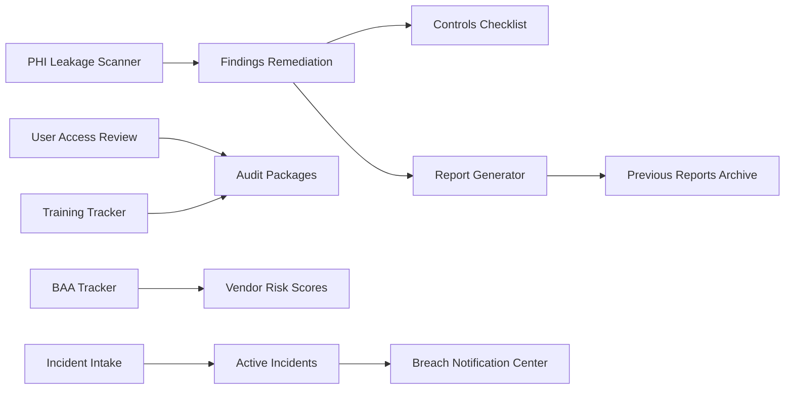

# HIPAA Shield Feature Specification

This document is the product blueprint for HIPAA Shield. It defines the feature model, UX behavior, role expectations, workflows, and delivery phases for the full HIPAA Compliance Manager dashboard.

## Product Principle

HIPAA Shield should feel like a professional compliance command center for healthcare security, privacy, compliance, and engineering teams. Every module should answer three questions quickly:

- What is the current risk or compliance state?
- Who owns the next action?
- What evidence proves the action happened?

## Global Architecture

### Core Objects

#### Organization

Represents the covered entity or health technology company using HIPAA Shield.

- Fields: name, logo, primary contact, security contact, privacy contact, timezone, legal address, covered entity / business associate classification.
- Used by: Settings, Reports, Audit Packages, Breach Notification Center.
- Auditability: every profile change creates an activity event.

#### User

Represents an application user or employee being tracked for access/training.

- Fields: name, email, department, manager, job function, employment status, assigned roles, training status, access review state.
- Used by: User Management, Training Tracker, User Access Review, Policy Acknowledgements.
- Auditability: role changes, deactivation, and access review decisions are immutable audit events.

#### Role

Represents RBAC permissions mapped to HIPAA job functions.

- Fields: role name, description, system permissions, data access level, approval requirements, assigned users.
- Used by: Role Management, Access Control Settings, User Access Review.
- Auditability: role permission changes require actor, timestamp, previous permissions, and reason.

#### Control

Represents a HIPAA safeguard or implementation specification mapped to internal controls.

- Fields: control ID, HIPAA citation, safeguard domain, implementation status, owner, evidence, review cadence.
- Used by: Controls Checklist, Risk Assessment, Audit Packages, Report Generator.
- Auditability: status changes and evidence uploads are versioned.

#### Finding

Represents an issue that needs remediation.

- Fields: title, description, severity, source module, owner, due date, status, affected systems, evidence, activity history.
- Used by: Dashboard, Findings & Remediation, PHI Leakage Scanner, Anomaly Alerts, Risk Assessment.
- Auditability: all status/owner/severity changes are logged.

#### Incident

Represents a security event or potential breach investigation.

- Fields: title, severity, type, reporter, investigator, timeline events, affected systems, affected individuals count, breach determination, notification deadlines.
- Used by: Incident Intake, Active Incidents, Breach Notification Center, Incident History.
- Auditability: timeline entries are append-only after creation.

#### Vendor

Represents a business associate, partner, or subcontractor.

- Fields: vendor name, covered services, BAA status, BAA dates, risk score, certifications, security questionnaire, subcontractors.
- Used by: BAA Tracker, Vendor Risk Scores, Subcontractor Register, Audit Packages.
- Auditability: BAA document changes and risk score decisions are versioned.

#### Training Assignment

Represents a workforce training obligation.

- Fields: employee, course, assigned date, due date, completion date, status, score, certificate/evidence.
- Used by: Training Tracker, Training Course Library, Reports.
- Auditability: course assignment/completion events are retained.

#### Report

Represents generated evidence or compliance output.

- Fields: report type, date range, filters, generated by, generated at, export formats, recipients, archive location.
- Used by: Report Generator, Scheduled Reports, Previous Reports Archive.
- Auditability: every export creates a report generation event.

### Global Statuses

Use the existing design system status pills.

- PASS: evidence verified, control effective, review approved.
- FAIL: control missing, issue confirmed, remediation failed.
- WARNING: risk exists but is not yet critical, deadline approaching.
- PENDING: waiting for approval, review, assignment, upload, or scan completion.

### Global Severity

Use the existing severity badge system.

- CRITICAL: patient data exposure or regulatory deadline at risk.
- HIGH: likely compliance failure or material operational exposure.
- MEDIUM: control gap requiring remediation but not immediately reportable.
- LOW: documentation, hygiene, or process improvement.

### Due Date Model

- On track: due date in the future and status is not blocked.
- Due soon: due in 7 days or less.
- Overdue: due date passed and status is not closed/approved.
- No due date: allowed only for draft or informational items.

### Universal Page Behavior

Every operational page should include:

- Page title and short purpose statement.
- Primary CTA at top-right when applicable.
- Summary cards for the module’s most important counts.
- Search and filters when the page contains more than 10 rows.
- Sortable tables for operational queues.
- Empty state with explanation and primary action.
- Loading skeletons for page-level loads.
- Error state with retry guidance.
- Activity/evidence history for compliance-significant objects.

### Dashboard Transition Motion

Use the required transition timing for dashboard page transitions:

```css
::view-transition-group(*),
::view-transition-old(*),
::view-transition-new(*) {
  animation-duration: 0.25s;
  animation-timing-function: cubic-bezier(0.19, 1, 0.22, 1);
}
```

## Page-by-Page Feature Specs

## Overview

### Dashboard

Purpose: command center for a single-glance health check of compliance posture.

Primary users: Compliance Manager, Security Officer, Privacy Officer.

Must-have widgets:

- Compliance score card and score ring.
- Open findings count.
- Active incidents count.
- Overdue training count.
- PHI scan status.
- Recent critical alerts.
- Upcoming deadlines: BAA expirations, access reviews, breach notification timers.

Primary actions:

- Run scan.
- View open findings.
- Open active incidents.
- Generate executive report.

Behavior:

- Every KPI card drills into its owning module.
- Critical alerts should appear in a full-width banner below the top bar.
- The dashboard must prioritize attention, not density: no more than one primary chart and one primary table above the fold.

Empty state:

- If no data exists, show onboarding cards: connect data source, invite users, add policies, run first scan.

Success metrics:

- Time to identify highest priority risk.
- Percentage of critical items with assigned owner.
- Number of overdue items.

### Compliance Score Trend

Purpose: show score movement over 30/60/90 days and explain why it changed.

Primary users: Compliance Manager, executives, auditors.

Must-have widgets:

- Time-range selector: 30, 60, 90 days.
- Line chart of compliance score.
- Annotation layer for score changes.
- Change log: findings added, remediations completed, controls verified, incidents opened/closed.

Primary actions:

- Export trend.
- Open annotation source.
- Compare to previous period.

Behavior:

- Hovering a point reveals score, date, and top drivers.
- Clicking annotation opens the source finding/control/incident.

## PHI Protection

### PHI Leakage Scanner

Purpose: detect PHI exposure across repositories and data stores.

Primary users: Developers, Security Officers, Compliance Managers.

Must-have widgets:

- Scan launcher: source, scope, schedule, scan depth.
- Scan history table.
- Findings table with severity, location, PHI type, owner, due date, false-positive state.
- Source coverage summary: repositories, databases, S3/object stores, email where supported.

Primary actions:

- Run scan.
- Schedule recurring scan.
- Assign finding owner.
- Mark false positive.
- Create remediation task.

Behavior:

- A scan can be queued, running, failed, completed, or cancelled.
- False positives require reason and reviewer.
- Critical findings automatically appear on Dashboard and Findings & Remediation.

### PHI Inventory

Purpose: catalog where PHI lives across systems.

Primary users: Privacy Officer, Compliance Manager, Security Officer.

Must-have widgets:

- Inventory table: system, PHI types, classification, owner, retention policy, last reviewed.
- Classification filter: direct identifiers, quasi-identifiers, clinical data, financial data.
- Owner review queue.
- System details panel.

Primary actions:

- Add system.
- Assign owner.
- Update retention policy.
- Start review.

Behavior:

- Systems without owner or retention policy are warnings.
- Systems with unknown classification are high priority until reviewed.

### De-identification Checker

Purpose: validate whether sample data is de-identified under Safe Harbor or Expert Determination.

Primary users: Privacy Officer, Developer, Data Analyst.

Must-have widgets:

- Upload/paste input.
- Mode selector: Safe Harbor, Expert Determination.
- Detection results by identifier type.
- Recommendation panel.

Primary actions:

- Check data.
- Export assessment.
- Save evidence.

Behavior:

- Never persist raw uploaded data unless user explicitly saves evidence.
- If identifiers remain, show exact category and remediation guidance.

## Access & Identity

### Access Control Settings

Purpose: define minimum necessary access, MFA, password, and session rules.

Primary users: Security Officer, Compliance Manager.

Must-have widgets:

- MFA enforcement status.
- Session timeout policy.
- Password policy.
- Minimum necessary access rules.
- Exceptions table.

Primary actions:

- Edit policy.
- Add exception.
- Review exception.
- Export policy evidence.

### Role Management

Purpose: manage RBAC roles tied to HIPAA job functions.

Primary users: Security Officer, Admin.

Must-have widgets:

- Role list.
- Permission matrix.
- Assigned users count.
- Sensitive permission flags.

Primary actions:

- Create role.
- Edit permissions.
- Duplicate role.
- Review role usage.

Behavior:

- Permission changes require reason.
- Roles with broad PHI access are highlighted.

### User Access Review

Purpose: periodic certification that users still need their access.

Primary users: Managers, Compliance Manager, Security Officer.

Badge semantics: nav badge `12` means 12 pending approvals.

Must-have widgets:

- Certification queue.
- User access table.
- Manager approval workflow.
- Review progress summary.

Primary actions:

- Approve access.
- Revoke access.
- Request more info.
- Bulk certify.

Behavior:

- Every decision captures reviewer, timestamp, decision, and rationale.

### Emergency Access Log

Purpose: audit break-glass access usage.

Primary users: Security Officer, Privacy Officer, Auditor.

Must-have widgets:

- Break-glass event table.
- Reason and target resource.
- Post-access review status.
- High-risk events summary.

Primary actions:

- Review event.
- Mark justified/unjustified.
- Create incident.

Behavior:

- Unreviewed emergency access older than 24 hours is critical.

## Security Controls

### Encryption Inventory

Purpose: track PHI systems and encryption posture.

Primary users: Security Officer, Developer.

Must-have widgets:

- System inventory table.
- Encryption method: AES-256, TLS 1.2+, managed keys, customer-managed keys.
- Key management status.
- Coverage metric.

Primary actions:

- Add system.
- Upload evidence.
- Flag exception.

### Audit Log Viewer

Purpose: searchable log of PHI access, modification, and deletion.

Primary users: Security Officer, Privacy Officer, Auditor.

Must-have widgets:

- Search bar.
- Filters: actor, patient/resource, action, system, date, outcome.
- Event detail drawer.
- Export controls.

Primary actions:

- Search logs.
- Save query.
- Export results.
- Create anomaly or incident.

### Anomaly Alerts

Purpose: detect suspicious PHI access behavior.

Primary users: Security Officer.

Must-have alert types:

- Off-hours access.
- Bulk downloads.
- Repeated failed logins.
- Unusual resource access.
- Access from new geography/device.

Primary actions:

- Investigate.
- Dismiss with reason.
- Convert to incident.
- Tune detection rule.

### Network & Transmission Security

Purpose: monitor secure transmission controls.

Primary users: Security Officer, Developer.

Must-have widgets:

- TLS certificate inventory.
- TLS version status.
- Firewall/VPN status.
- Transmission policy checklist.

Primary actions:

- Upload evidence.
- Create finding.
- Renew certificate.

## Risk & Compliance

### Risk Assessment

Purpose: perform HIPAA-required annual risk analysis.

Primary users: Compliance Manager, Security Officer, Privacy Officer.

Must-have widgets:

- Assessment wizard.
- Threat/vulnerability library.
- Likelihood × impact matrix.
- Past assessment history.

Primary actions:

- Start assessment.
- Assign section.
- Approve assessment.
- Export assessment.

### Findings & Remediation

Purpose: manage open findings through remediation.

Primary users: Compliance Manager, Security Officer, Developers.

Badge semantics: nav badge `8` means open remediation backlog.

Must-have widgets:

- Findings table.
- Owner, severity, due date, source, status.
- Remediation activity timeline.
- Evidence upload.

Primary actions:

- Assign owner.
- Change due date.
- Add evidence.
- Mark remediated.
- Verify remediation.

Behavior:

- Closing a finding requires evidence and verifier.
- Overdue critical findings appear on Dashboard.

### Policy Library

Purpose: manage HIPAA policies and version history.

Primary users: Privacy Officer, Compliance Manager.

Must-have policies:

- Privacy Rule policy.
- Security Rule policy.
- Breach Notification policy.
- Sanctions policy.
- Access control policy.

Primary actions:

- Upload policy.
- Publish version.
- Request acknowledgement.
- Archive version.

### Controls Checklist

Purpose: map controls to HIPAA Security Rule safeguards.

Primary users: Compliance Manager, Auditor.

Must-have widgets:

- Control list grouped by Administrative, Physical, Technical safeguards.
- HIPAA citation.
- Implementation status.
- Evidence status.
- Owner and review cadence.

Primary actions:

- Update status.
- Attach evidence.
- Open related findings.
- Export checklist.

## Vendors & Partners

### BAA Tracker

Purpose: track Business Associate Agreements.

Primary users: Privacy Officer, Compliance Manager.

Badge semantics: nav badge `2` means BAAs expiring soon.

Must-have widgets:

- Vendor table.
- BAA status.
- Signed date.
- Expiration date.
- Covered services.
- Renewal alert state.

Primary actions:

- Upload BAA.
- Set renewal reminder.
- Mark vendor inactive.
- Create finding for missing/expired BAA.

### Vendor Risk Scores

Purpose: evaluate business associate risk.

Primary users: Security Officer, Compliance Manager.

Must-have widgets:

- Vendor scorecards.
- Questionnaire status.
- Certification evidence: SOC 2, HITRUST, ISO.
- Risk drivers.

Primary actions:

- Send questionnaire.
- Upload certification.
- Override score with reason.
- Approve/reject vendor.

### Subcontractor Register

Purpose: track subcontractors used by business associates.

Primary users: Privacy Officer, Compliance Manager.

Must-have widgets:

- Sub-BA list.
- Parent BA.
- Service scope.
- Sub-BAA status.
- Review date.

Primary actions:

- Add subcontractor.
- Request BAA evidence.
- Flag missing coverage.

## Workforce

### Training Tracker

Purpose: monitor employee HIPAA training completion.

Primary users: Compliance Manager, HR/Admin.

Badge semantics: nav badge `5` means overdue assignments.

Must-have widgets:

- Training completion summary.
- Employee assignment table.
- Overdue filter.
- Department/manager breakdown.

Primary actions:

- Assign course.
- Send reminder.
- Mark exempt with reason.
- Export training evidence.

### Training Course Library

Purpose: manage and assign HIPAA training courses.

Primary users: Compliance Manager.

Must-have widgets:

- Course catalog.
- Course detail page.
- Assignment rules.
- Completion metrics.

Primary actions:

- Add course.
- Assign course.
- Retire course.
- Upload evidence/certificate template.

### Policy Acknowledgements

Purpose: track workforce policy sign-off.

Primary users: Privacy Officer, Compliance Manager.

Must-have widgets:

- Policy acknowledgement matrix.
- User sign-off status.
- Timestamp and version.
- Reminder queue.

Primary actions:

- Request acknowledgement.
- Send reminder.
- Export sign-off evidence.

### Sanctions Log

Purpose: document disciplinary actions for HIPAA violations.

Primary users: Privacy Officer, Compliance Manager, HR/Admin.

Must-have widgets:

- Sanctions table.
- Violation type.
- Action taken.
- Related incident/finding.
- Confidential notes access control.

Primary actions:

- Add sanction.
- Link incident.
- Upload evidence.

Behavior:

- This module must be permission-restricted.

## Incidents & Breach

### Incident Intake

Purpose: log a new security event or potential breach.

Primary users: All users, Privacy Officer, Security Officer.

Must-have fields:

- Reporter.
- Event type.
- Description.
- Date/time discovered.
- Systems involved.
- PHI involved / unknown.
- Affected individual estimate.
- Attachments.

Primary actions:

- Submit incident.
- Save draft.
- Attach evidence.

### Active Incidents

Purpose: manage in-progress investigations.

Primary users: Security Officer, Privacy Officer.

Must-have widgets:

- Active incident queue.
- Timeline.
- Assigned investigator.
- Severity and SLA.
- Breach determination status.

Primary actions:

- Add timeline event.
- Assign investigator.
- Escalate severity.
- Determine breach.
- Close incident.

### Breach Notification Center

Purpose: manage confirmed breach notification obligations.

Primary users: Privacy Officer, Compliance Manager, Legal.

Must-have widgets:

- 60-day notification countdown.
- Affected individual count.
- HHS notification status.
- Individual notification letter drafts.
- Media notification requirement flag.

Primary actions:

- Generate letter.
- Mark HHS notified.
- Upload proof.
- Export breach package.

### Incident History

Purpose: retain closed incidents and lessons learned.

Primary users: Security Officer, Privacy Officer, Auditor.

Must-have widgets:

- Closed incident archive.
- Outcome summary.
- Root cause.
- Lessons learned.
- Related findings.

Primary actions:

- View postmortem.
- Export incident record.
- Reopen with reason.

## Reports & Audit

### Report Generator

Purpose: build on-demand compliance reports.

Primary users: Compliance Manager, Auditor.

Must-have widgets:

- Report type selector.
- Domain selector.
- Date range.
- Export format: PDF, CSV.
- Preview.

Primary actions:

- Generate report.
- Save template.
- Export.

### Scheduled Reports

Purpose: automate recurring reports.

Primary users: Compliance Manager.

Must-have widgets:

- Schedule list.
- Frequency.
- Recipients.
- Last run status.
- Next run date.

Primary actions:

- Create schedule.
- Pause schedule.
- Run now.
- Edit recipients.

### Audit Packages

Purpose: generate evidence bundles for OCR audits or internal reviews.

Primary users: Compliance Manager, Auditor.

Must-have packages:

- OCR audit.
- Internal review.
- Security Rule evidence.
- Vendor/BAA evidence.
- Workforce training evidence.

Primary actions:

- Build package.
- Add/remove evidence.
- Export package.

### Previous Reports Archive

Purpose: store generated reports and packages.

Primary users: Compliance Manager, Auditor.

Must-have widgets:

- Archive table.
- Report type.
- Generated by.
- Generated date.
- Download link.
- Retention date.

Primary actions:

- Download.
- Re-run report.
- Delete if allowed by retention policy.

## Settings

### Organization Profile

Purpose: manage organization identity and compliance contacts.

Primary users: Admin, Compliance Manager.

Must-have widgets:

- Organization info.
- Logo.
- Primary contacts.
- Covered entity/business associate classification.

### Integrations

Purpose: connect SSO, SIEM, EHR, cloud providers, Slack alerts, and APIs.

Primary users: Admin, Security Officer, Developer.

Must-have widgets:

- Integration catalog.
- Connection status.
- Last sync.
- Error state.
- API key management.

### Notification Preferences

Purpose: define who gets alerted for what.

Primary users: Admin, Compliance Manager.

Must-have widgets:

- Alert routing matrix.
- Severity thresholds.
- Delivery channels.
- Escalation rules.

### User Management

Purpose: add/remove app users and assign roles.

Primary users: Admin.

Must-have widgets:

- User table.
- Invite flow.
- Role assignment.
- Deactivation workflow.

### Billing & Plan

Purpose: manage plan tier and billing details.

Primary users: Admin, Billing owner.

Must-have widgets:

- Plan summary.
- Usage counters.
- Billing contact.
- Invoices.
- Upgrade/downgrade controls.

## Role-Based Experience

### Healthcare Security Officer

Daily priorities:

- Anomaly Alerts.
- Audit Log Viewer.
- Encryption Inventory.
- Network & Transmission Security.
- Active Incidents.

Allowed actions:

- Investigate anomalies.
- Create incidents.
- Upload technical evidence.
- Update security control status.
- Review emergency access.

Escalations:

- Critical anomaly creates incident.
- Expired TLS cert creates high finding.

### Privacy Officer

Daily priorities:

- PHI Inventory.
- De-identification Checker.
- Incident Intake.
- Breach Notification Center.
- Policy Acknowledgements.

Allowed actions:

- Determine breach status.
- Approve Safe Harbor / Expert Determination evidence.
- Manage policies.
- Review sanctions log.

Escalations:

- Confirmed breach starts 60-day notification workflow.

### Compliance Manager

Daily priorities:

- Dashboard.
- Findings & Remediation.
- Risk Assessment.
- Controls Checklist.
- Reports & Audit.

Allowed actions:

- Assign findings.
- Approve risk assessments.
- Generate audit packages.
- Review control evidence.

Escalations:

- Overdue critical findings escalate to leadership.

### Developer

Daily priorities:

- PHI Leakage Scanner.
- Assigned findings.
- Encryption/network technical controls.

Allowed actions:

- Run scans.
- Mark technical remediation ready for verification.
- Upload implementation evidence.

Restrictions:

- Cannot close compliance findings without verifier approval.
- Cannot alter policy or breach determinations.

## End-to-End Workflows

### PHI Issue Lifecycle

1. Scanner detects PHI leakage.
2. Finding is created with severity and source evidence.
3. Owner is assigned.
4. Developer remediates and uploads evidence.
5. Compliance/Security verifies.
6. Finding closes and score improves.
7. Report Generator can include the resolved finding.

### Access Certification Cycle

1. Compliance Manager starts review campaign.
2. Managers receive assigned user access rows.
3. Managers approve/revoke/request info.
4. Revocations create access tasks.
5. Campaign closes when all rows have decisions.
6. Evidence is archived for audit packages.

### Vendor Risk and BAA Renewal Cycle

1. Vendor is added.
2. BAA and covered services are recorded.
3. Vendor risk questionnaire/certifications are collected.
4. Risk score is generated or reviewed.
5. Expiring BAAs appear in dashboard and BAA badge.
6. Renewal evidence is archived.

### Incident to Breach Notification Cycle

1. Incident is submitted.
2. Investigator triages severity and PHI involvement.
3. Timeline events and evidence are added.
4. Privacy Officer determines breach status.
5. If confirmed, Breach Notification Center starts 60-day clock.
6. Notifications and proof are generated.
7. Incident closes with postmortem and lessons learned.

### Quarterly Audit Package Cycle

1. Compliance Manager selects package type.
2. System pulls controls, policies, trainings, incidents, vendors, reports.
3. Missing evidence creates findings.
4. Package is exported and archived.

## Cross-Feature Handoff Map



## Implementation Roadmap

### Phase 1: Operational Spine

Build first because these modules create the highest daily value:

- Dashboard.
- Findings & Remediation.
- PHI Leakage Scanner.
- Incident Intake.
- Active Incidents.

Dependencies:

- Finding object.
- Incident object.
- Assignment/owner model.
- Activity history.

### Phase 2: Governance Backbone

Build next to satisfy core HIPAA program operations:

- Controls Checklist.
- Risk Assessment.
- Policy Library.
- User Access Review.
- Access Control Settings.

Dependencies:

- Control object.
- Policy versioning.
- Review campaigns.
- Evidence attachments.

### Phase 3: Ecosystem Management

Build after governance model is stable:

- BAA Tracker.
- Vendor Risk Scores.
- Subcontractor Register.
- Training Tracker.
- Training Course Library.
- Policy Acknowledgements.

Dependencies:

- Vendor object.
- Training assignment object.
- Notification reminders.

### Phase 4: Audit and Intelligence

Build once evidence data is populated:

- Report Generator.
- Scheduled Reports.
- Audit Packages.
- Previous Reports Archive.
- Anomaly Alerts.
- Compliance Score Trend.

Dependencies:

- Reporting templates.
- Score history snapshots.
- Audit package assembler.
- Detection rules.

### Phase 5: Platform Administration

Complete operational maturity:

- Organization Profile.
- Integrations.
- Notification Preferences.
- User Management.
- Billing & Plan.

Dependencies:

- Role model.
- Integration health model.
- Billing provider integration.

## Acceptance Checklist

- Each module has a defined owner role.
- Each module has at least one primary action.
- Each queue has filters, sorting, empty, loading, and error states.
- Every compliance-significant action creates audit history.
- Badge counts map to clear operational meaning.
- Dashboard KPIs drill into owning modules.
- Reports and audit packages can consume evidence from every module.
